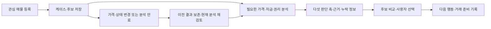
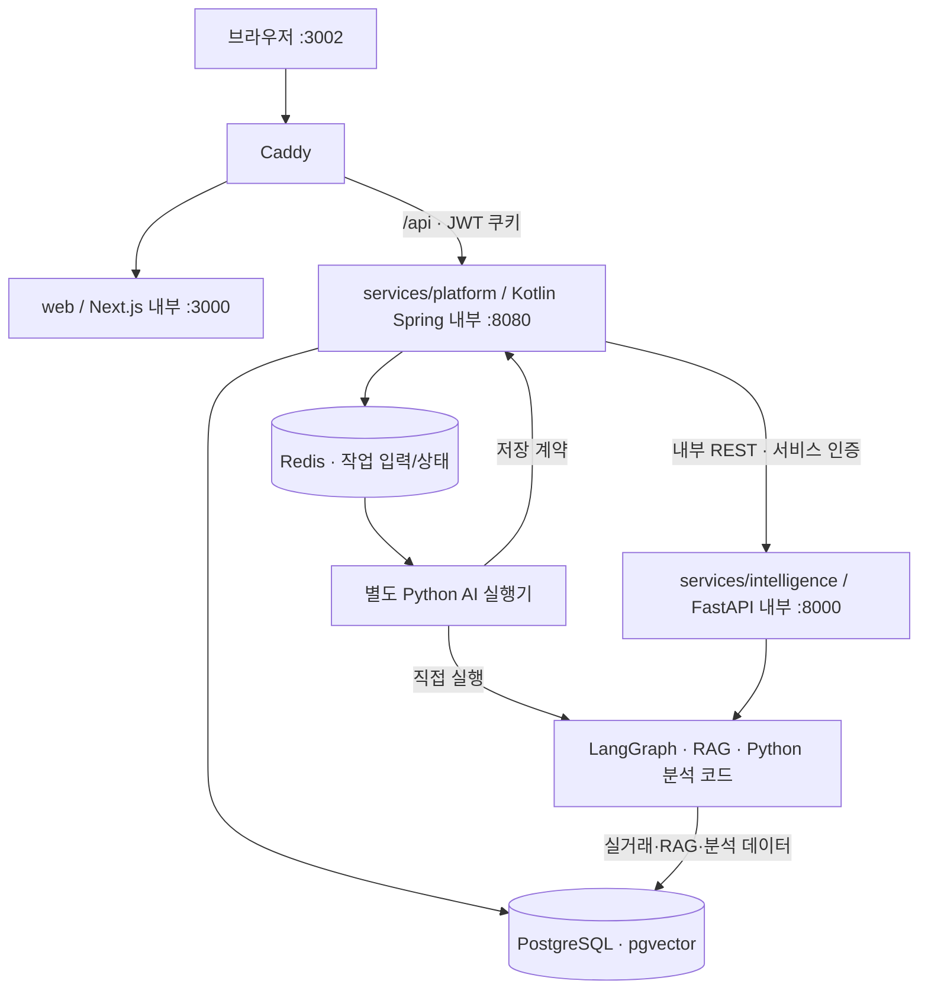

# Property Concierge

사용자가 관심 있는 부동산을 가져와 **가격·자금·권리·미확인 사항을 검토하고 매수 여부를 결정하도록 돕는 부동산 의사결정 플랫폼**이다.
매물 등록부터 분석·비교·선택 이유·다음 행동·거래 준비 기록을 하나의 매수 케이스로 연결한다.
현재는 **아파트 매수 의사결정 기반을 강화하는 단계**이며, 독립 모바일 앱은 후속 계획이다.

문서 갱신: **2026-10-02**. 최근 실행 검증은 2026-10-01 기준이다.
[문서 목록](docs/README.md) · [현재 구현과 다음 작업](docs/project-handoff.md) · [제품 전략](docs/product-strategy.md)

> 시세추정은 자동가치산정(AVM) 기반 참고용 분석이며 「감정평가 및 감정평가사에 관한 법률」에 따른 감정평가가 아니다.
> 자금·세금 계산은 입력 가정에 따른 예상값이며 대출 승인·확정 세액이 아니다. AI는 사용자를 대신해 매수나 계약을 결정하지 않는다.

## 현재 사용자 흐름



동네 탐색을 거치지 않아도 직접 등록한 매물로 시작할 수 있다. 주소 검색에서 확인한 이름·도로명·지번과
사용자가 입력한 호가·면적·확인 시각을 구분하고, **별칭은 선택 입력**으로 별도 저장한다.
네이버 부동산 링크는 외부 탐색 보조다. 원문을 추출하지 못해도 확인한 값으로 직접 등록할 수 있다.

분석을 모두 자동 실행하는 흐름은 아니다. 사용자가 필요한 분석을 실행하며 미입력·실패·낮은 신뢰도·만료는
안전 또는 0원으로 바꾸지 않는다. 최종 후보 선택 후 계약 전·잔금 전·잔금일·거래 후의 기본 작업 18개를 관리한다.
작업 완료 표시는 실제 계약·대출·등기를 서비스가 완료했다는 뜻이 아니다.

자세한 현재 제품 흐름, 비동기 실행, AVM·RAG·도구 분기는 [최신 파이프라인](docs/architecture.md#pipelines)을 따른다.

## 기능과 현재 범위

| 기능 | 제공 범위 | 상세 설명 |
|---|---|---|
| 매물 보관함 | 주소·URL·직접 입력·CSV 등록, 선택 별칭, 출처·확인 시각·관측·변경 이력 | [매물](docs/features/listings.md) |
| 매수 케이스 | 공통 매수 조건·후보·분석·체크리스트·비교·선택/제외 이유 | [의사결정](docs/features/decision.md) |
| 매수 검토 요약 | 적합성·가격성·자금성·위험성·실행성의 근거·기준일·미확인 정보·다음 행동 | [판단 축](docs/features/decision.md#decision-assessment) |
| AVM | 국토부 실거래 기반 유형별 가격 분석, 신뢰도·비교사례·본인 리포트 저장 | [AVM 흐름](docs/architecture.md#pipelines-avm) |
| 자금·세금 | Kotlin의 대출·취득비용·현금흐름·간이 세금·LTV/DSR 계산; 화면·챗봇·비교의 동일 엔진 | [자금 기준](docs/features/decision.md#funding-input) |
| 권리 위험 점검 | 업로드 PDF 텍스트·규칙 기반 위험 신호, 판독 실패·미확인 표시 | [분석 경계](docs/architecture.md#pipelines-rights) |
| AI 컨시어지·법률 챗봇 | 조건 해석·등록 매물 검색·동네/단지 탐색·AVM·자금·비교·법령 RAG, 대화 기억·새로고침 복원 | [챗봇](docs/features/chat.md) |
| 동네 탐색 | 시·도 → 시·군·구 → 법정동, 동일 조건 실거래 통계·아파트 단지 탐색 | [동네 탐색](docs/features/exploration.md) |
| 거래 준비 | 선택 후보의 일정·확인자·결과·근거·문제·외부 대기 기록 | [화면 흐름](docs/features/decision.md#navigation) |
| 운영 | 관리자 권한·준비 상태·큐/실행기 감시·재수집·백업·작업 복구 | [운영](docs/operations.md) |

## 시스템 구조



위 실행기는 같은 Intelligence 이미지의 Python 분석 코드를 직접 실행한다. 모든 작업을 FastAPI로 다시 호출한다는 뜻은 아니다.
공개 API **8002**는 Spring이고, Python은 내부 전용이다. 브라우저 JWT는 Spring이 검증하고 Python에는 서비스 키와 확인한 사용자 ID를 전달한다.

| 영역 | 책임 |
|---|---|
| Kotlin + Spring Boot | 회원·OAuth·비밀번호 재설정·인증/인가·주소 조회, 매물·케이스·거래 상태·분석 이력·작업 저장, 고정 금융/세금 수식·운영 API |
| Python + FastAPI / LangGraph | LLM·RAG·임베딩·AVM·조건 추출·랭킹·문서 점검·실거래 수집/분석, 별도 AI 작업 실행 |
| TypeScript + Next.js | 화면·입력·대화·분석 진행·후보 카드·비교·복원; 현재 작업 대기는 폴링 사용 |
| PostgreSQL·Redis | 업무·데이터·벡터 저장과 공유 상태; SQLite·인프로세스 메모리 운영 폴백 없음 |

이전된 저장·권한·고정 계산의 중복 Python 구현은 제거했다. 공유 스키마의 DDL은 현재 **Alembic 하나로 관리**하며 Spring 자동 DDL을 사용하지 않는다.
서비스 간 명세는 [contracts](contracts/README.md), 정확한 저장·계산 경계는 [아키텍처](docs/architecture.md)를 따른다.

## 저장소 구성

```text
property_concierge/
├── services/
│   ├── platform/        인증·매물·케이스·거래·고정 계산·운영 API
│   └── intelligence/    AI·RAG·AVM·추천·공식 데이터 분석·평가
├── web/                 Next.js 사용자 화면
├── contracts/           내부 API 명세·계약 버전
├── infrastructure/      Docker·Caddy·DB 초기화·배포
├── scripts/             통합 검증·운영·Compose 실행 도구
├── tests/               서비스 연결·보안·분석 회귀
├── docs/                기능별 설명·구조·운영·기획·포트폴리오
├── data/                샘플·보정 자료·수집 원문
├── backups/             로컬 백업 (Git 제외)
└── evaluation-results/  로컬 검증 산출물 (Git 제외)
```

데이터와 로컬 `.env`는 루트에 유지한다. 개발 제약은 [AGENTS.md](AGENTS.md)를 따르며 `CLAUDE.md`는 이를 임포트한다.

## 빠른 시작

현재 PC는 Windows의 Node/npm, WSL의 Python·Docker를 사용한다. PostgreSQL·Redis가 필수다.
처음 설정할 때만 `.env.example`을 `.env`로 복사하고 기존 `.env`를 덮어쓰지 않는다.

```powershell
if (-not (Test-Path -LiteralPath .env)) { Copy-Item -LiteralPath .env.example -Destination .env }
# .env의 POSTGRES_PASSWORD·JWT_SECRET_KEY·INTERNAL_SERVICE_SECRET과 필요한 외부 API 키 입력
./scripts/compose.ps1 local up -d --build
```

Linux/WSL에서는 `sh scripts/compose.sh local up -d --build`를 사용한다.

| 주소·실행 모드 | 의미 |
|---|---|
| http://localhost:3002 | 사용자 웹 |
| http://localhost:8002/health | Spring 프로세스 상태 |
| http://localhost:8002/ready | DB·Redis·실행기 등의 준비 상태 |
| `local` | 베이스 이미지 실행; DB·Redis 호스트 포트 비공개 |
| `dev` | 개발 오버레이: Python 소스 마운트·단일 reload 워커·DB/Redis 포트 공개 |
| `production` | 도메인·HTTPS 오버레이; 공개 운영 서버·도메인 별도 필요 |

실행 도구는 루트 `.env`·프로젝트 경로·`property_concierge` 이름을 고정해 기존 네트워크·볼륨을 유지한다.
루트에서 옵션 없이 `docker compose up`을 실행하는 이전 방식은 사용하지 않는다.
실거래 갱신과 백업 서비스는 `maintenance` 프로필을 명시적으로 활성화한다. [운영 절차](docs/operations.md)를 따른다.

### 외부 API·모델 설정

전체 양식은 [.env.example](.env.example)을 따른다. 키는 Git·로그·브라우저 코드에 넣지 않는다.

| 설정 | 역할 |
|---|---|
| `KAKAO_REST_API_KEY` | 주소·좌표 조회 |
| `MOLIT_API_KEY` | 국토부 실거래·건축물 자료 조회 |
| `LAW_OC_KEY` | 국가법령정보센터 법령 수집 |
| `RBONE_API_KEY` / `ECOS_API_KEY` / `VWORLD_API_KEY` | 지수·금리·토지 보강; 미제공 값의 폴백·미확인 처리 유지 |
| `LLM_PROVIDER` | 기본 LLM 역할 |
| `CHAT_LLM_PROVIDER` / `APPRAISAL_INTENT_LLM_PROVIDER` | 챗봇·컨시어지 / AVM 의도 추출의 역할별 override |
| `OPENROUTER_API_KEY` / `OPENROUTER_MODEL` | OpenRouter 호출 자격·모델 ID |
| `EMBED_PROVIDER` | 일반 임베딩 역할; 법령 코퍼스의 별도 임베딩 설정도 확인 필요 |

현재 로컬 설정은 기본 LLM·임베딩 **Ollama**, 챗봇과 AVM 의도 추출 **OpenRouter**다.
모든 모델 호출이 OpenRouter로 바뀐 것은 아니다. 프로바이더·임베딩 모델 변경은 기존 pgvector 자료와 차원·모델 호환성을 확인한 뒤 적용한다.
Resend 메일·Google OAuth의 실도메인 설정은 [운영 문서](docs/operations.md)의 검증 경계를 따른다.
`docker compose config` 전체 출력에는 실제 시크릿이 포함될 수 있으므로 공유하지 않는다.

## 주요 API

브라우저는 Spring의 `/api/*`를 사용한다. 아래는 대표 경로이며 내부 Python 함수를 공개 HTTP API로 설명하지 않는다.

| 경로 | 역할 |
|---|---|
| `/api/auth/*` | 회원·로그인·OAuth·재설정·로그아웃·탈퇴 |
| `/api/listings/address/search` · `/api/listings/*` | 서명된 주소 선택·등록·검색·관측·후보 연결 |
| `/api/cases/*` | 케이스·후보·요약·비교·선택·거래 준비 |
| `POST /api/appraisal/jobs` · `GET /api/appraisal/jobs/{id}` | AVM 접수·진행·결과 |
| `POST /api/simulation` | Kotlin 고정 계산과 본인 후보 결과 연결 |
| `POST /api/rights/analyze` | 사용자 PDF 위험 점검 |
| `/api/concierge/jobs` · `/api/chat/jobs` | 컨시어지·법률 챗봇 작업 |
| `GET /api/jobs/{id}/events` | 작업 상태 SSE; 현재 웹은 폴링을 사용 |
| `/api/market/*` · `/api/recommendation/complexes` | 실거래 지역 통계·단지 탐색 |
| `/api/history/*` · `/api/activity` · `/api/operations/*` | 본인 이력·활동·관리자 운영 |

작업·케이스·이력은 사용자 소유 범위에서 조회하며 타인 자료는 404로 처리한다.
내부 `/internal/v1/*`는 서비스 키가 필요하다. Spring 전체 공개 OpenAPI는 아직 별도 생성하지 않았다.

## 개발·검증

Python 회귀와 Spring 통합 실행기는 **같은 격리 DB를 사용하므로 순서대로** 실행한다.
`real_estate_test`·Redis **15** 보호를 우회하지 않는다. 서비스 DB에는 pytest를 연결하지 않는다.

```bash
# 로컬 격리 테스트에 필요한 DB·Redis 호스트 포트 활성화
sh scripts/compose.sh dev up -d pgvector redis
./venv-wsl/bin/python -m pip install -r services/intelligence/requirements.txt
./venv-wsl/bin/python -m pip install --no-deps -e services/intelligence
./venv-wsl/bin/python scripts/run_isolated_tests.py tests/ -q
./venv-wsl/bin/python scripts/run_spring_tests.py --browser
./venv-wsl/bin/python scripts/run_spring_tests.py --evaluation
./venv-wsl/bin/python scripts/export_service_contracts.py --check
```

Windows PowerShell의 `web/`에서 타입 검사·린트·빌드를 실행한다.

```powershell
cd web
npx tsc --noEmit
npm run lint
npm run build
```

2026-10-01 로컬 검증: Python **1,095 통과·1 건너뜀**, 브라우저 흐름 **6종**, 고정·가상 입력 평가 **34건**,
프론트 타입·린트·빌드와 Docker 서비스 연결·실제 주소 조회 확인. Kotlin 단위 검증 25건의 기존 기록과
전체 검증 범위는 [인수인계](docs/project-handoff.md#검증-상태와-경계)를 따른다.
이 수치는 실제 매수 성과·전국 AVM 정확도·전체 LLM 대화 성공률이 아니다. 원격 CI 완료와 로컬 성공도 구분한다.
평가 실행·정답셋·보고서는 [평가 도구](services/intelligence/evaluation/README.md)를 따른다.

## 데이터·운영 한계와 다음 작업

- 사용자 호가·조건은 사용자 제공 자료다. 서비스가 모든 실호가·현재 매물 존재·개별 호의 동일성을 독립 검증한 것은 아니다.
- 동네 탐색의 실거래 단지는 현재 광고 매물이 아니다. 샘플 추천·비교는 **가상 CSV 43건**으로 실제 사용자 후보와 구분한다.
- 기존 서초구 434건 AVM 백테스트의 ±10% 적중률은 동일 단지 69~84%, 동일 동·구 8~33%였다. 모든 지역에 일반화하지 않는다.
- 권리 PDF 원문은 무저장이다. 판독 실패·문서 미제공·발급일/페이지 근거 부족을 권리 안전으로 표시하지 않는다.
- 금융·세금은 기존 간이 정책과 입력 가정에 따른 계산이다. 대출 심사·감면·세대/주택 수 예외를 자동 확정하지 않는다.
- 공개 서버·도메인의 HTTPS, Google 실도메인 OAuth·Resend 도메인 인증/실발송은 별도 적용·검증이 필요하다.

다음은 **주소·동일 물건 식별 → 비교사례·문서의 항목별 근거 → 실제 아파트 전체 흐름·실패 처리 평가 → 소규모 사용자 운영** 순서다.
임장·협상·명시적 선호 기록, 자산 유형 확대, Marketplace·거래 당사자 연결은 후속 단계이며 모바일 앱은 나중에 진행한다.
작업별 증빙 원문 보관은 소유권·개인정보·보관 정책을 정한 뒤 검토하며 당장의 선행 조건으로 두지 않는다.
단계별 완료 기준은 [제품 전략](docs/product-strategy.md#단계별-완료-기준)을 따른다.

## 문서·발표 자료

[문서 목록](docs/README.md)에서 기능별 안내를 읽는다. 구조와 최신 파이프라인은 [아키텍처](docs/architecture.md),
진행 상태는 [인수인계](docs/project-handoff.md), 운영·복구는 [운영 문서](docs/operations.md), 과거 근거는 [실측 기록](docs/verification-history.md)에 관리한다.

포트폴리오: [발표 HTML](docs/portfolio/index.html) · [원본·생성·검증](docs/portfolio/README.md).
발표 원본은 **2026-09-08 검증 스냅샷**이며 이번 README·파이프라인 최신화가 발표 슬라이드의 내용까지 갱신한 것은 아니다.
새 자료를 만들 때 현재 구현과 향후 기획, 고정 자료 테스트와 실제 모델·원문 평가를 구분한다.
