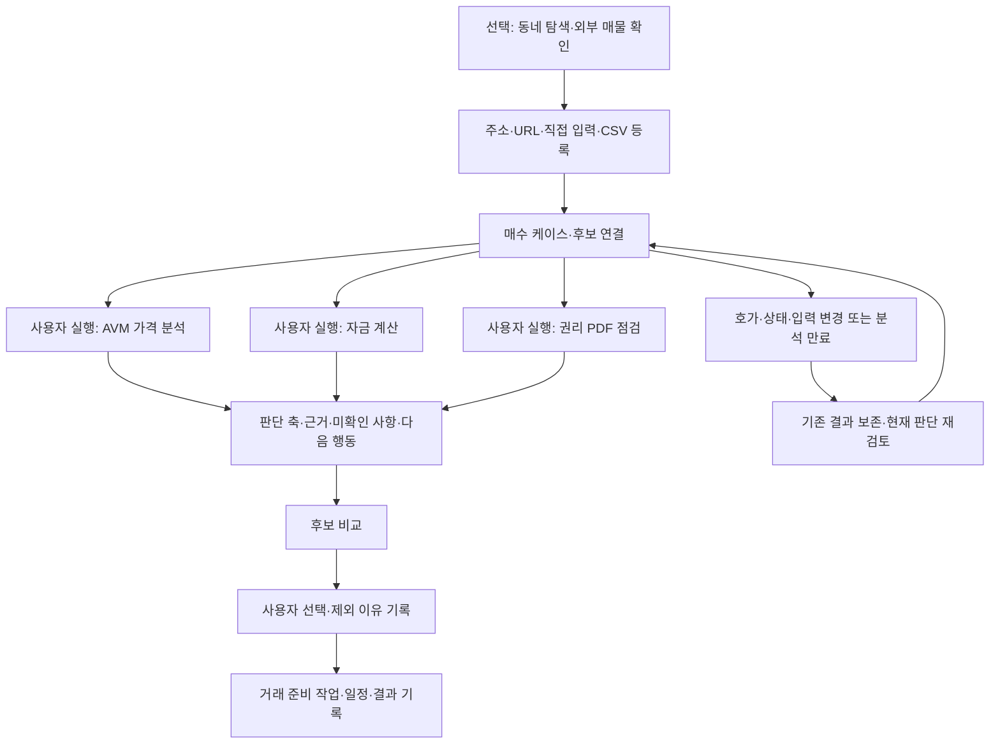
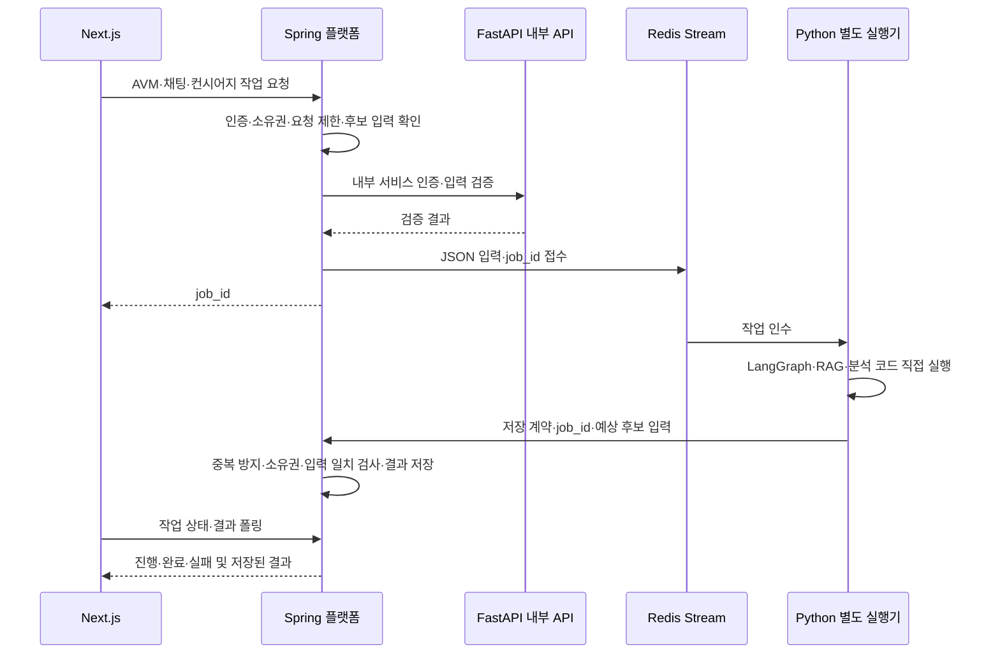
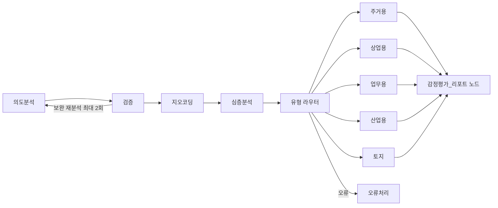

# 서비스 구조·저장·계산 책임

저장소 구성, Kotlin 플랫폼과 Python 분석 서비스의 책임, 내부 API·고정 수식 계산의 경계와 최신 파이프라인을 한곳에서 관리한다.

[문서 목록](README.md)

- [저장소 구조와 실행 경로](#repository)
- [서비스 분리와 저장·권한 계약](#backend)
- [고정 수식과 모델 추정의 책임](#calculations)
- [최신 파이프라인](#pipelines)

<a id="repository"></a>

## 저장소 구조와 실행 경로

2026-10-01에 사용자 요청에 따라 인증·거래 플랫폼, AI·데이터 분석, 웹 화면과 실행 인프라를 분리했다.
언어가 아니라 서비스의 책임을 폴더 기준으로 사용한다. 내부 패키지의 도메인 경계와 API 동작은 유지한다.

| 이전 경로 | 현재 경로 | 책임 |
|---|---|---|
| `core-service/` | `services/platform/` | 인증·권한·매물·케이스·거래 상태·고정 계산·업무 저장·운영 API |
| `api/`, `backend/`, `db/`, `schemas/`, `evaluation/` | `services/intelligence/` 아래 동일 이름 | 내부 AI 계약·LLM·RAG·AVM·랭킹·데이터 분석·평가 |
| `frontend/` | `web/` | Next.js 사용자 화면 |
| 루트 Dockerfiles | `infrastructure/docker/` | platform·intelligence·web 이미지 |
| 루트 Compose 파일 | `infrastructure/compose/` | 베이스·개발·HTTPS 운영 구성 |
| `docker/Caddyfile*`, `docker/init.sql` | `infrastructure/proxy/`, `infrastructure/database/` | 프록시·DB 초기화 |
| 내부 명세 분산 | `contracts/v1/` | 코드에서 생성한 OpenAPI와 플랫폼 호출 계약 |

`scripts/`, `tests/`, `docs/`는 통합 운영·검증·설명을 담당하므로 루트에 유지한다.
`data/`, `backups/`, `evaluation-results/`, `.env`, 로컬 가상환경은 상태·설정·산출물이다.
기존 데이터·계정·DB 스키마를 이동하거나 삭제하지 않았다.

<a id="repository-실행-경로"></a>

### 실행 경로

Compose를 직접 호출할 때는 저장소 루트를 `--project-directory`로 지정해야 한다.
실수로 다른 프로젝트 이름의 새 DB 볼륨을 만들지 않도록 실행 도구가 `-p property_concierge`를 고정한다.

```bash
sh scripts/compose.sh local up -d --build
sh scripts/compose.sh dev up -d pgvector redis
sh scripts/compose.sh production up -d --build
```

PowerShell: `./scripts/compose.ps1 local up -d --build`.
루트에서 옵션 없이 `docker compose up`을 실행하는 이전 방식은 사용하지 않는다.
Compose 서비스 이름·이미지·컨테이너 이름은 유지해 네트워크와 볼륨 연결을 보존한다.
웹 3002, 공개 API 8002, 내부 AI 8000의 경계도 같다.

Python을 직접 실행할 때는 `services/intelligence`를 editable package로 설치한다.
`concierge_workspace.py`는 서비스 코드 경로와 루트 데이터 경로를 구분하며,
운영 스크립트는 같은 경로 설정을 사용한다. 루트에 이전 Python 구현이나 호환용 복제 폴더를 두지 않는다.

```bash
./venv-wsl/bin/python -m pip install -r services/intelligence/requirements.txt
./venv-wsl/bin/python -m pip install --no-deps -e services/intelligence
./venv-wsl/bin/python -m alembic -c services/intelligence/alembic.ini current
./venv-wsl/bin/python scripts/run_isolated_tests.py tests/ -q
./venv-wsl/bin/python scripts/run_spring_tests.py --browser
./venv-wsl/bin/python scripts/export_service_contracts.py --check
```

공유 스키마의 마이그레이션은 `services/intelligence/db/migrations/`에 유지한다.
Spring에 별도 DDL 책임을 추가하지 않는다. 순수 분석 모듈의 Python import 이름도 그대로다.

<a id="repository-이번-이동-검증"></a>

### 이번 이동 검증

- 격리 PostgreSQL·Redis를 사용하는 Python 회귀 테스트: 1,095 통과·1 건너뜀.
- Spring 실제 저장·권한·작업·변경 재검토 연결 18개, 계산 검증 6개, 프록시 2개 통과.
- 브라우저 6종: 등록·후보·선택·변경 재검토·복원, 이동, 공통 조건, 자금, 다섯 축, 주소·별칭 확인.
- `web/` 타입 검사·린트·프로덕션 빌드, 세 서비스 Docker 빌드 통과.
- 로컬·HTTPS 운영 Compose 계약과 코드에서 생성한 내부 계약 일치 확인.
- 고정·가상 입력 오프라인 평가 34건 통과.
- 새 경로로 로컬 Docker 재기동 후 웹 3002·API 8002, 실제 작업 실행·결과 저장·SSE,
  카카오 주소 조회 연결 확인. API·작업 실행기의 주요 Python 모듈 29개가 현재 소스와 일치한다.

브라우저 AVM 결과는 고정 검증 자료다. 이 이동 검증은 실제 LLM·AVM의 정확도나 전국 데이터 완성도를 뜻하지 않는다.


<a id="backend"></a>

## 서비스 분리와 저장·권한 계약

기준일: 2026-10-01. 백엔드 전환 언어는 **Kotlin**이다. Spring의 사용자·저장·권한·거래 상태와
Python의 LLM·RAG·AVM·의사결정 분석을 분리한다. 자금·세금의 고정 수식 계산은 Kotlin이다. 모바일 앱은 이후 단계다.

<a id="backend-현재-실행과-전환-범위"></a>

### 현재 실행과 전환 범위

기본 실행은 웹 3002 → Caddy → Kotlin Spring이며 공개 API 8002도 Spring이다.
Next.js는 내부 3000, Spring은 8080, Python은 8000에서 실행한다. Python에는 공개 포트가 없다.
`/api/*`는 Caddy가 Spring으로 직접 전달하고 Next 서버의 내부 API 대상도 Spring이다.
같은 PostgreSQL 스키마를 사용하며 이 단계에서 데이터를 다른 DB로 복사하지 않는다.

```text
Next.js / API 클라이언트
    ↓ 기존 경로와 호환되는 /api
Kotlin Spring
    ├ 사용자 인증·소유자 확인·매물 검색 조건
    ├ 사용자 매물·케이스·후보·선택·거래 준비 트랜잭션
    ├ 분석 이력·매물 관측 기록·Redis 작업 상태
    ├ 대출·세금·현금흐름·수익·자금 부족 계산
    └ 내부 REST → Python
                    ├ CSV 정규화 (주소 증명 확인은 Spring 호출)
                    ├ 소유자 확인된 스냅샷의 다섯 판단 축·비교·다음 행동
                    ├ 기존 AVM·권리·LLM·RAG 실행
                    └ 자금 조건 해석·리포트 표현 → Spring 계산 계약
Python 별도 실행기 → Spring 내부 저장 계약 → PostgreSQL / Redis
```

Spring이 직접 제공하는 공개 경로는 가입·로그인·내 정보·로그아웃, 매물 조회·CSV 저장,
매수 케이스·후보·비교·요약·선택·원본 변경 재검토·체크리스트·거래 준비 작업,
작업 상태 조회와 `/api/jobs/{job_id}/events`다.
`POST /api/simulation`도 Spring이 입력·소유자 확인·계산·결과 저장을 제공한다. Python은 계산된 결과의 기존 리포트 표현만 생성한다.
OAuth·비밀번호 재설정·메일·탈퇴·주소 조회·이력·활동·신고·운영·재수집·AI 작업 접수도 Spring이다.
추천·AVM·권리·챗봇 공개 요청은 Spring이 인증하고 명시적인 내부 분석 경로로 호출한다.
범용 `/api/**` 중계 컨트롤러와 Python 일반 API·인증·주소·레이트 리밋 파일 **16개**를 삭제했다.
Python은 `/api`를 제공하지 않는다. 서비스 키 검증은 개발 환경에서도 필수다.
경로 재도입은 `scripts/audit_python_routes.py`가 실패로 처리한다. 호환 모듈은 AI가 사용하는 내부 호출 계약만 유지한다.
`scripts/audit_backend_cleanup.py --containers property_concierge_backend property_concierge-job-worker-1`은
46개 저장·17개 계산 계약에 실행 구현이 남지 않았는지와 컨테이너의 관련 모듈이 원본과 일치하는지 확인한다.

<a id="backend-저장-책임-설정"></a>

### 저장 책임 설정

`CORE_STORAGE_URL`과 내부 인증키는 Python API·실행기에도 필수다. 아래 Python 모듈은 함수 계약만
보존한 Spring 클라이언트이며 중복 SQL 저장 구현을 제거했다. 미설정·연결 실패는 503이고 Python SQL로 대체하지 않는다.
케이스 스냅샷의 순수 표현·근거 분석은 `case_snapshot_presentation.py`에 분리했다.

| 영역 | Python 호환 모듈 | Spring 저장 구현 |
|---|---|---|
| 회원·비밀번호 버전 | 실행 Python 모듈 없음 | `AccountStore`·`SessionService`·`AccountLifecycleController` |
| 케이스·후보·관심 지역·선택 | `services/intelligence/api/case_db.py` | `CaseStore` |
| 거래 준비 일정·작업 | `services/intelligence/api/case_execution_db.py` | `ExecutionStore` |
| 매물·가격 변경 이력 | `services/intelligence/backend/services/listing_store.py` | `ListingService` |
| 수집 시도·관측 | `services/intelligence/backend/services/listing_observations.py` | `ListingObservationStore` |
| AVM·활동 이력 | `services/intelligence/api/history_db.py`·`services/intelligence/api/activity_db.py` | `AnalysisHistoryStore` |
| 작업 접수·진행·완료 | `services/intelligence/api/jobs.py` | `AiJobStore` |

API와 별도 Python 실행기에 같은 `CORE_STORAGE_URL`·`INTERNAL_SERVICE_SECRET`을 적용해야 한다.
한쪽만 전환해서 양쪽 프로세스가 같은 영역을 직접 저장하게 만들지 않는다.
기본 Docker 실행은 API와 실행기에 같은 저장 주소를 주입하고 Python에 `REQUIRE_INTERNAL_SERVICE_AUTH=1`을 설정한다.
`.env`의 수동 실행 설정을 바꿔도 Compose의 영역별 저장 책임은 바뀌지 않는다.
분석에 쓰는 국토부 거래·법령 벡터·임베딩·전용 분석 캐시는 Python 영역에 남긴다.
Alembic이 스키마를 먼저 적용하며 Spring은 자동 DDL을 하지 않는다.

<a id="backend-내부-계약과-null-처리"></a>

### 내부 계약과 null 처리

내부 REST는 `X-Internal-Service-Key`로 인증한다. 32자 이상의 무작위 키가 필요하며
내부 인증키는 Spring·Python에 동일하게 설정한다. JWT 인증은 Spring만 수행한다.
Python은 브라우저 쿠키를 받지 않고 서비스 키와 `X-AI-User-Id`를 받는다. 브라우저에 내부 키를 전달하지 않는다.
주소 증명 검증은 `/internal/v1/addresses/verify`로 Spring을 호출한다. 기존 토큰의 서명·소유자·만료 계약을 유지한다.
Spring → Python은 `/internal/v1/listing-import/validate`, `/decision/decorate`, `/decision/assess`, `/appraisal/summary`를 사용한다.
이 경로는 전달받은 지역·소유자 확인된 스냅샷·결과를 처리하며 DB 조회·저장을 하지 않는다.
Python → Spring은 `/internal/v1/store/{영역}/{작업}`을 사용한다.
Python API 기동은 주소·키만 검증한다. 기동 중 Spring 응답까지 기다리면 Spring의 Python 준비 상태 의존과
순환 대기가 생기므로, 실제 호출 시 연결 실패를 처리한다. 테스트는 기동 후 `/internal/v1/testing/storage`에서
실제 `real_estate_test`·Redis 15인지 확인한다. 이 점검은 운영 저장소에서 403으로 거부한다.
계산은 `/internal/v1/calculations/{작업}`을 사용한다. [계산 책임](#calculations)에서 수식·모델의 경계를 확인한다.
챗봇에서 후보 자금 분석을 실행할 때는 `/internal/v1/simulation`을 사용한다. 공개 실행과 같은
`SimulationController.execute`가 사용자·후보 소유권을 확인하고 변경 전 입력을 캡처한 뒤 계산·저장한다.
원격 리포트 처리 중 후보가 삭제되거나 입력이 변경되면 저장 성공으로 반환하지 않는다.

필수 문자열·숫자는 non-null이고 미확인 금액·대출 조건은 nullable다. 미확인을 0으로 채우지 않는다.
Jackson이 JSON null을 0·false로 바꾸거나 `List<String>` 안에 null을 넣는 것을 차단한다.
등록 요청은 Kotlin DTO와 Bean Validation으로 형식·범위를 확인하고, 변경 요청은 누락과 null을 구분한다.
알 수 없는 필드와 소수 금액을 거부한다. 기존 금액 단위 원·면적 단위 ㎡, AVM 만원 변환을 유지한다.
Python에서 넘어온 CSV 정수도 64비트 범위를 검사해 Kotlin 변환 중 금액이 바뀌는 것을 막는다.
내부 저장 계약의 일부는 아직 JSON 스냅샷을 사용하므로 전체 도메인이 Kotlin 타입으로 완전히 모델링된 상태는 아니다.

케이스 조회는 짧은 읽기 전용 REPEATABLE READ 트랜잭션에서 예산·후보·분석·원본 상태를 모은다.
DB 연결을 반환한 뒤 Python 분석을 호출한다. 동시에 가격·예산을 수정해도 서로 다른 시점의 값이 섞이지 않게 한다.

<a id="backend-실행과-검증"></a>

### 실행과 검증

`.env.example`의 내부 인증키를 설정한 뒤 기본 서비스를 실행한다. 아래 명령은 기존 개발 DB 포트와
마운트를 유지한다. `sh scripts/compose.sh dev config`의 전체 출력은 키를 노출할 수 있으므로 보관하지 않는다.

```bash
sh scripts/compose.sh dev up -d --build
./venv-wsl/bin/python scripts/check_compose_contract.py
./venv-wsl/bin/python scripts/run_isolated_tests.py tests/ -q
./venv-wsl/bin/python scripts/run_spring_tests.py --browser
```

Spring 검증은 PostgreSQL `real_estate_test`·Redis 15와 임시 API·Spring·실행기만 사용한다.
브라우저 검증은 임시 Next.js와 검사 중 생성한 계정을 사용하며 종료 시 계정과 컨테이너를 제거한다.
Python 테스트와 Spring 검증은 같은 격리 DB를 공유하므로 순서대로 실행한다.
실제 서비스 DB·Redis에서 pytest를 실행하지 않는다.

API 통합 검증 산출물은 `evaluation-results/spring-core-result.json`이다.
검증 내용은 JWT·bcrypt 양방향 호환, 소유자 404, CSV 미리보기·저장·전체 롤백·시점 관리,
후보·분석·선택·가격 변경 재검토·복원, 작업 큐·별도 실행기·SSE, 관측 실패의 가격 보존,
비밀번호 변경 후 일반·AI 공개 경로 JWT 무효화다. AVM은 고정 결과로 저장·단위 변환을 검증했고 자금 계산은 실제 계산기를 사용한다.
실제 AVM 정확도·LLM 대화 품질·외부 매물 추출 성공률을 검증한 결과는 아니다.
SSE는 작업 상태 전송이며 LLM 토큰 스트리밍은 아직 구현하지 않았다. 현재 프론트엔드는 기존 폴링을 유지한다.

기본 Caddy는 클라이언트가 전달한 IP 헤더를 신뢰하지 않는다. Spring은 고정 Caddy 주소만,
Python은 고정 Spring 주소만 신뢰한다. 사설망 전체나 `*`를 허용하지 않는다.
`spring-gateway-result.json`은 직접 접속과 Caddy 경유 각각의 위조 헤더 11회 요청에서
열한 번째가 429이며 동일 클라이언트 제한이 유지되는지 확인한다. 운영 감시기는 Spring의 생존도 확인한다.
HTTPS 배포 파일은 Spring 직접 포트를 없애고 80/443만 공개한다. 실제 서버·도메인 배포는 별도 작업이다.

<a id="backend-2026-10-01-검증-기록"></a>

#### 2026-10-01 검증 기록

- Python 전체: **1,086개 통과·1개 건너뜀**. `real_estate_test`와 Redis 15만 사용했다.
- Kotlin 단위: **9개 통과**. JWT·비밀번호 버전·JSON null·금액·DB/Redis 설정을 검증했다.
- Spring/Python 통합: **18개 항목 통과**(동시 수정 중 조회 일관성 포함), 프록시 위조 방어 **2개 항목 통과**.
- 격리 브라우저: 매물 등록 **9개**, 이동 **7개**, 자금 **13개**, 의사결정 **13개**, 총 **42개 항목 통과**.
- 프론트엔드 타입·린트·Docker 프로덕션 빌드 통과. 로컬/HTTPS Compose의 포트·저장 책임 설정 검사 통과.
- 실제 웹 3002: 조건 저장·탐색 입력·계산 결과 표시·후보·의견·화면·복원 **7개 항목 통과**.
- 실행 서비스 연결 **4개 항목 통과**: 설정 일치·가입 쿠키·Python 직접 요청 차단·실제 실행기 결과 저장과 Caddy SSE.
  산출물은 `evaluation-results/spring-deployment-result.json`이다. 생성한 검증 계정은 삭제했다.

검증 전 서비스 DB 백업을 생성했다. 실제 서비스의 DB·Redis 볼륨을 교체하거나 다른 DB로 복사하지 않았다.
원격 GitHub Actions 실행 성공이나 실제 AVM·LLM·권리 판독 정확도 검증을 뜻하지 않는다.

같은 날 자금·세금 계산을 Kotlin으로 이전한 후 Python **1,092개 통과·1개 건너뜀**, Kotlin **18개 통과**로 갱신했다.
Spring 통합 18개·프록시 2개·격리 브라우저 42개도 다시 통과했고 계산 연결 6개 항목을 추가했다.
기존 수식 54개 조건의 전체 결과 대조는 금액 차이 0원이었다. 상세 범위는 [계산 검증 기록](#calculations-2026-10-01-계산-이전-검증-기록)을 따른다.
Docker 재빌드 후 실제 웹 자금 흐름 13개·계산 연결 4개·실행 서비스 연결 4개를 확인했다.

<a id="backend-2026-10-01-중복-python-구현-제거-후-검증"></a>

#### 2026-10-01 중복 Python 구현 제거 후 검증

회원·매물·관측·케이스·거래 준비·분석/활동 이력·작업 상태의 Python SQL 구현과
금융·세금 수식을 제거하고 내부 계약 클라이언트만 유지했다. 원본 데이터·벡터스토어·AI 분석·Alembic은 남겼다.
기존 수식 54건의 전체 결과는 고정 자료로 보존하며, Python 회귀 테스트도 격리 Spring을 호출한다.
HTTP 왕복에서 같은 숫자의 Jackson 노드 타입 차이를 후보 변경으로 오인하던 비교도 수정했다.

- Python **1,092개 통과·1개 건너뜀**, Kotlin 단위 **19개 통과**.
- Spring 통합 **18개**, 계산 연결 **6개**, 프록시 **2개** 통과. 고정 계산 54건의 금액 최대 차이 **0원**.
- 격리 브라우저 6종 **56개 항목** 통과: 매물 9·이동 7·품질 7·자금 13·판단 축 13·주소/별칭 7.
  주소 응답·단지·거래 자료는 가상이며 실제 주소 공급자 정확도의 검증이 아니다.
- 오프라인 평가 **34건 통과**. 실시간 LLM 답변·외부 법령/실매물 품질 검증을 뜻하지 않는다.
- 프론트엔드 타입·린트·프로덕션 빌드 및 Compose 계약 검사 통과.
- Docker 반영 후 실행 서비스 연결 **4개**, API/실행기 계산 연결 **4개** 통과. 검증 계정은 삭제했다.

<a id="backend-2026-10-01-중복-http-핸들러요청-스키마-제거-후-검증"></a>

#### 2026-10-01 중복 HTTP 핸들러·요청 스키마 제거 후 검증

가입·로그인·내 정보·로그아웃, 케이스 CRUD·후보·선택·거래 준비, 매물 조회·CSV 등록,
자금 실행·작업 상태의 중복 **33개 Python HTTP 경로**를 삭제했다. 사용하지 않는 CRUD 요청
스키마·로그인 잠금 구현·Python 자금 저장 분기도 제거했다. 공유 자금 입력은 별도 스키마로 옮겼다.
OAuth·재설정·탈퇴·주소·직접 등록·관심 지역·AI 분석은 여전히 사용 중인 Python 경로다.

- Python **1,098개 통과·1개 건너뜀**, Kotlin **25개 통과**. 기존 소유자 격리·세션 무효화 검증은 유지했다.
- 기존 HTTP 회귀 테스트의 이전된 경로는 실제 격리 Spring을 호출한다. Python에 임시 핸들러를 다시 만들지 않았다.
- 삭제 중 발견한 매물 수집 작업의 비로그인 조회 차이를 수정해 기존 **401** 정책을 유지했다.
- 계산 중 후보 삭제·가격 변경을 Kotlin 단위에서 검증하고 내부 서비스 인증 실패·잘못된 결과를 Python에서 성공으로 처리하지 않게 했다.
- Spring 통합 **18개**·계산 연결 **6개**·프록시 **2개**, 브라우저 **56개**, 오프라인 평가 **34건** 통과.
- 프론트엔드 타입·린트·빌드 통과. Docker 반영 후 실행 서비스 **4개**·계산 연결 **4개** 통과.
- 원본 코드와 API·작업 실행기의 **26개 모듈** 일치, **52개 저장·17개 계산** 계약에 중복 구현 없음,
  **중복 HTTP 경로 0개**를 확인했다. `evaluation-results/cleanup-code-audit.json`에 기록했다.

검증 자료는 `backend-junit.xml`, `kotlin-route-tests/`, `spring-core-result.json`,
`core-calculations-result.json`, 브라우저 보고서, 실행 서비스 보고서에 보존한다.
외부 주소·법령·실매물·실시간 LLM 답변의 실제 품질과 원격 GitHub Actions 성공은 별도 검증 범위다.

<a id="backend-2026-10-01-일반-백엔드-kotlin-이전-완료"></a>

#### 2026-10-01 일반 백엔드 Kotlin 이전 완료

OAuth·비밀번호 재설정·메일·탈퇴·주소 검색/서명·이력·활동·신고·운영 화면·재수집·AI 접수를
Spring으로 옮겼다. Python 일반 API·인증·주소·레이트 리밋 파일 16개와 범용 중계 컨트롤러를 삭제했다.
기존 JWT·bcrypt·주소 증명은 `tests/legacy_*` 자료로 Spring 호환성을 검증하며 실행 서비스에서 임포트하지 않는다.
Python의 HTTP는 내부 AI·데이터·스냅샷 분석이고 서비스 키를 항상 검증한다.

- Python 회귀 **1,095개 통과·1개 건너뜀**, Kotlin 단위 **25개 통과**.
- Spring 통합 **18개**, 실제 계산 연결 **6개**, 프록시 위조 방어 **2개**, 브라우저 6종 **56개 항목** 통과.
- 오프라인 평가 **34건**, 프론트엔드 타입 검사·린트·빌드 통과.
- Docker 재빌드·재기동 후 실제 서비스 연결 **4개**와 실제 카카오 주소 공급자 연결 **1개** 통과.
- Spring 공개 경로 **81개**, Python 공개 업무 경로 **0개**, 대체된 파일 잔존 **0개**를 확인했다.
  API·실행기 관련 **29개 모듈**이 원본과 일치하며 저장 **46개**·계산 **17개** 내부 계약에 중복 구현이 없다.

산출물: `general-migration-backend-junit.xml`, `general-migration-kotlin-reports/`,
`spring-core-result.json`, `core-calculations-result.json`, 브라우저 보고서,
`spring-deployment-result.json`, `spring-address-deployment-result.json`, `cleanup-code-audit.json`.
OAuth의 실제 Google 계정 콜백과 Resend 실발송은 검증하지 않았다. 주소 공급자 연결은 확인했으나
개별 호·실매물 존재·호가 및 실제 LLM·AVM 정확도를 검증한 결과는 아니다.

<a id="backend-후속-고도화"></a>

### 후속 고도화

1. 입력·결과 스냅샷의 계약 버전과 DTO를 보강하고 케이스 저장 함수를 영역별 서비스로 나눈다.
2. 실제 AVM·권리 문서·실거래 사례와 공개 배포 환경의 장애·복구를 별도로 평가한다.
3. 장기적으로 스키마 관리와 AI 전용 데이터 접근 계정도 분리한다. 현재 Alembic은 공유 스키마의 단일 관리 도구다.

지역·권리·금액의 부족한 사실을 추정으로 메우거나 기존 수치 가드레일·작업 복구 규칙을 제거하지 않는다.


<a id="calculations"></a>

## 고정 수식과 모델 추정의 책임

기준일: 2026-10-01. 고정 수식의 자금·세금 계산은 Kotlin + Spring Boot에서 실행한다.
모델 기반 AVM·RAG·자연어 해석·문서 분석은 Python + FastAPI에 둔다.
모델이 상승률 등의 가정을 제시해도 복리·현금흐름·수익률 산술은 Kotlin에 전달한다.
LLM이 금융 계산기의 수치를 대신 생성하지 않는다.

<a id="calculations-이번-이전-범위"></a>

### 이번 이전 범위

| 계산 | 실행 위치 |
|---|---|
| 원리금균등·원금균등·만기일시, 첫 달 상환·보유 기간 이자 | Kotlin `FinanceCalculator` |
| 취득세·중개보수·기타 비용·필요 현금·현금 부족 | Kotlin `FinanceCalculator`·`FundingRequest` |
| 월 현금흐름·성장률별 세후 손익·ROI·손익분기·금리 민감도 | Kotlin `FinanceCalculator` |
| 간이 양도·보유·증여·상속세·공시가격 비율 추정 | Kotlin `TaxRules` |
| 간이 LTV·스트레스 DSR·최대 대출액 역산 | Kotlin `FinanceCalculator` |
| 자연어 조건·세금 도구 선택·결과 설명·RAG·문서 분석·AVM | Python |
| 공통 조건의 비상자금 차감·시나리오 입력 조합·리포트 표현 | 기존 Python/프론트 어댑터 |
| AVM 비교거래의 통계 보정·추천 점수·다섯 판단 축의 규칙 | 기존 Python, 다음 영역별 이전 대상 |

통계적 시세추정은 현재 비교거래·보정 로직을 포함한다. AVM 전체가 학습 모델로만 구현되었다고 설명하지 않는다.
유형별 분석 모듈의 산술을 이번 금융 계산 이전으로 모두 바꾼 것은 아니다.

<a id="calculations-실행-계약"></a>

### 실행 계약

공개 `POST /api/simulation`은 Spring의 `SimulationController`다. 로그인과 후보 소유자를 확인하고,
검증된 입력으로 계산한 후 후보 분석을 저장한다. 선택한 후보가 계산 중 변경되면 이전 결과의 연결을 거부한다.
Python `/internal/v1/simulation/report`는 전달된 입력·결과의 기존 마크다운과 리포트 래퍼만 생성한다.
이 표현 단계에는 재계산·DB 조회·LLM 호출이 없다.

Python의 시뮬레이션 도구는 `/internal/v1/calculations/simulation`, 후보 요약은 `funding_summary`,
법률·세금 챗봇은 `calc_gift_tax`, `calc_inheritance_tax`, `calc_capital_gains_tax`, `calc_annual_holding_tax`를 호출한다.
시나리오·대화·시뮬레이션 그래프가 동일 계산 도구를 공유한다. 추천 점수 계산은 아직 Python에 있다.
후보에 저장하는 챗봇 자금 분석은 `funding_execution_client.py` → `/internal/v1/simulation`으로
공개 API와 같은 계산·소유자 확인·변경 감지·저장을 실행한다. 이전 Python POST 핸들러와 저장 분기는 제거했다.
공통 대화 입력은 `services/intelligence/schemas/funding_request.py`에 두며, 이 파일은 금융 수식 구현이 아니다.
내부 서비스 키가 필수이며 브라우저에 전달하지 않는다.

`CORE_STORAGE_URL`은 저장과 계산 책임을 함께 지정한다. 기본 Compose는 API·별도 실행기 모두 같은 Spring을 지정한다.
연결이 지정된 환경의 장애·잘못된 결과는 실패로 처리하고 기존 Python 수식이나 LLM 계산으로 대체하지 않는다.
중복 Python 수식은 제거했다. 기존 Python 함수는 Kotlin 내부 계약을 호출하는 클라이언트다.
이전 수식의 대조값 54건은 `tests/fixtures/finance_migration.json`에 고정 보존한다.
이 값은 마이그레이션 회귀 기준이며 독립적인 세법 정답셋이 아니다. 미설정 환경에서도 계산을 대체하지 않는다.

<a id="calculations-금액과-정책-기준"></a>

### 금액과 정책 기준

금액은 원 단위 정수이며 중간 계산은 BigDecimal 34자리 정밀도로 수행한다.
최종 원 단위 반올림은 HALF_EVEN, 대출 비율에서 대출 원금을 만들 때만 버림이다.
비율을 문자열 기반 십진수로 변환해 `100 × 0.58`이 57원으로 잘리는 부동소수 오차를 피한다.
연환산 ROI의 분수 지수는 실수 연산 후 소수 둘째 자리로 반올림한다.
원 단위 결과 범위를 넘으면 422를 반환하고 값을 잘라 저장하지 않는다.
미확인 소득·공시가격은 null이며 소득 0의 DSR은 미검증이다. 무자본 투자의 ROI는 정의하지 않는다.

무이자 대출은 원 단위 월 상환액을 반올림하더라도 총 이자 0·총 상환 원금을 유지한다.
기존 Python의 `반올림 월액 × 개월 − 원금`으로 생기던 소액의 음수 이자를 Kotlin에서는 만들지 않는다.
수정된 원금 잔액은 실제 금융기관의 마지막 회차 상환표를 재현한 것이 아니다.

새 결과의 `calculator_engine`, `calculation_version`, `rounding_policy`, `tax_rules_as_of`와
후보 요약의 엔진·버전·기준일을 보존한다. 과거 저장 결과는 자동 재계산하지 않는다. 별도 DB 마이그레이션은 없다.

이전한 정책은 기존 **2026-01-01 기준 간이 규칙**이다. 이번 작업에서 최신 법령·세율의 예외·조정지역 이력·
다주택 중과 유예 종료·금융기관 심사를 새로 검증하지 않았다. 취득세 가격 구간·비주거 세금·주택 합산 등 기존 근사 한계도 유지한다.
법령 정책을 갱신할 때 Kotlin 원본·계산 버전·독립 정답과 회귀 테스트를 함께 관리해야 한다.
제거 전 결과 자료는 당시 이관의 기록이므로 새 정책에 맞춰 임의로 덮어쓰지 않는다.
대출 승인·법정 세액 확정·수익 예측의 적중률로 표시하지 않는다.

<a id="calculations-검증"></a>

### 검증

- Kotlin 단위: 수기 비용·대출·세금 사례, 상환 방식·무이자·소득 미검증·전세·금액 null/소수·반올림·범위 초과.
- Python `tests/test_core_calculations.py`: 계산 연결 실패의 503, 조건 거부의 422, 입력과 다른 결과 거부, 대출 원금 십진수 변환.
- `scripts/verify_core_calculations.py`: 격리 Spring에서 수기 정답, 제거 전 Python 수식의 고정 결과 54개 전체 대조,
  1·2·3주택의 공개 API·실제 챗봇 도구·시나리오·저장 요약 일치, 세금 챗봇 4종 연결.
- `scripts/run_spring_tests.py --browser`: 기존 후보 등록·분석·선택·변경·재검토·복원과 화면 검증도 이어서 수행.

검증은 PostgreSQL `real_estate_test`와 Redis 15만 사용하며 Python 테스트와 순차 실행한다.
산출물은 `evaluation-results/core-calculations-result.json`이다. 수식 이전·호출 연결·기존 정책의 수기 사례를
검증하는 것이며 실제 LLM 추출 품질·최신 법령 정확도·대출 승인·매수 수익을 검증하는 것은 아니다.

<a id="calculations-2026-10-01-계산-이전-검증-기록"></a>

#### 2026-10-01 계산 이전 검증 기록

- Python 전체 **1,092개 통과·1개 건너뜀**, Kotlin 단위 **18개 통과**.
- Spring/Python 통합 **18개**, 계산 연결 **6개**, 프록시 **2개**, 격리 브라우저 **42개 항목 통과**.
- 기존 수식 **54개 조건**의 전체 결과 대조에서 금액 최대 차이 **0원**. 이 샘플 밖의 모든 반올림 결과가 같다는 뜻은 아니다.
- 프론트엔드 타입·린트·Docker 프로덕션 빌드 및 로컬/HTTPS Compose 계약 검사 통과.
- Docker 반영 후 실제 웹·Spring API·Python API·작업 컨테이너의 계산 연결 **4개**, 실행 서비스 연결 **4개**,
  실제 웹 자금 흐름 **13개 항목 통과**. 생성한 검증 계정은 삭제했다.
  계산 연결 산출물은 `evaluation-results/calculation-deployment-result.json`이며 컨테이너 계산은 직접 도구 실행이다.

무이자·소액 원금의 이자 수정은 수기 기대값으로 검증했으며 기존 수식과 차이가 의도된 경계 사례다.
원격 CI 실행 완료와 실제 법령·모델 정확도 검증은 위 기록에 포함하지 않는다.

같은 날 중복 Python 수식 제거 후에도 Python **1,092개 통과·1개 건너뜀**, Kotlin **19개 통과**,
고정 결과 54건 대조·계산 연결 6개를 확인했다. 격리 브라우저는 주소·별칭과 품질 흐름을 포함해
**56개 항목**이 통과했고, Docker 반영 후 API·실행기의 Kotlin 계산 연결 4개도 통과했다.

<a id="pipelines"></a>

## 최신 파이프라인

2026-10-02의 코드 기준이다. 사용자 매물 등록을 출발점으로 두며, 동네 탐색·외부 포털 링크는 선택적으로 사용한다.
장기 기획의 Property 모델·Buyer Decision Graph·Marketplace·모바일 앱 전체가 구현된 것은 아니다.
[제품 전략](product-strategy.md)과 [현재 구현 상태](project-handoff.md)를 구분해 읽는다.

### 매수 의사결정 흐름



등록 시 확인한 도로명·지번·이름과 사용자 호가·면적·별칭을 분리한다. 별칭은 선택 사항이다.
외부 URL의 자동 추출 실패는 직접 입력으로 이어지며, 미확인 값을 실제 매물 정보로 확정하지 않는다.
관측·변경 이력을 저장하지만 광고가 사라졌다는 이유로 거래 완료를 확정하지 않는다.

요약은 적합성·가격성·자금성·위험성·실행성으로 나누고, 미분석·실패·낮은 신뢰도와 근거 부족을 표시한다.
가격 30일·자금 14일·권리 7일의 분석 유효기간과 입력 변경 여부를 함께 검사한다.
실행 중 후보 입력이 바뀌면 과거 입력으로 만든 결과를 현재 후보에 자동 연결하지 않는다.
선택 이후 기본 거래 준비 작업 18개는 기록·확인용이다. 완료 체크가 실제 계약·등기 완료를 보증하지 않는다.

### AI 작업 접수·결과 연결



이 그림은 작업 API 경로다. 모든 분석이 큐를 거치는 것은 아니며 권리 PDF 점검과 일부 동기 분석 경로는 내부 REST 호출을 사용한다.
실행기는 같은 Intelligence 이미지의 Python 함수를 직접 실행한다. API 프로세스 안의 임시 스레드 작업으로 대체하지 않는다.
Spring은 JWT와 저장 권한을 담당하고, Python에는 내부 서비스 키와 검증한 사용자 ID를 전달한다.
Python의 업무 저장 호출은 Spring 내부 계약을 이용하며 AI·실거래·벡터 자료의 데이터 처리는 Intelligence에 남는다.

작업 상태 SSE API도 있으나 현재 웹은 폴링을 사용한다. LLM 토큰 스트리밍이 연결되었다고 설명하지 않는다.
중단된 AVM·수집 작업의 복구와 채팅·컨시어지의 재질문 경계는 [작업 복구](operations.md#job-recovery)를 따른다.

<a id="pipelines-avm"></a>

### AVM: 의도 해석 → 주소 확정 → 유형별 분석 → 리포트



노드명은 현재 `appraisal_graph.py`를 따른다. 리포트 명칭과 관계없이 결과는 **참고용 AVM**이며 법정 감정평가가 아니다.
의도 분석의 보완 질문은 내부 재분석에만 쓰인다. 사용자에게 질문하고 응답을 기다리는 대화형 보완 흐름은 구현 범위에 포함하지 않는다.

LLM이 주소·면적·유형 후보를 해석한 뒤 지오코딩과 공식 자료로 보강한다. 사용자 지정 유형·구조화 입력과 충돌하는
LLM 추정을 확정값으로 덮어쓰지 않는다. 국토부 실거래 저장 자료를 조회하고 필요하면 API로 보강하며 비교사례를 선정한다.
주거·토지의 시점수정은 R-ONE 지수, 다른 유형은 현재 근사 규칙을 사용한다.
유형별 비교·보정과 신뢰도 산정 후 의견을 생성한다. AVM 의견의 허용되지 않은 수치는 출력 검증하고,
위반 시 1회 재생성 후 결정론적 폴백을 사용한다. 내부 만원 단위와 외부 원 단위의 변환은 리포트 경계에서 처리한다.
유형 분기가 존재한다는 사실이 모든 지역·자산에서 같은 정확도로 검증됐다는 뜻은 아니다.

<a id="pipelines-funding"></a>

### 자금: 공통 입력 → Kotlin 고정 계산 → 후보 연결

케이스의 자금 조건과 후보 가격·면적 등을 합쳐 입력을 만들고 Spring 계산 엔진에서 대출 상환·취득비용·필요 현금·월 부담을 계산한다.
화면과 챗봇 도구, 후보 비교는 같은 고정 계산을 사용한다. LLM은 계산 조건 해석과 결과 설명을 맡으며 수식을 대체하지 않는다.
세금의 주택 수 기준·현금 여유분·반올림은 [계산 책임](#calculations)과 [자금 입력 기준](features/decision.md#funding-input)을 따른다.
결과에는 입력 가정·기준일을 남기며 후보 입력이 달라졌으면 재계산이 필요하다. 실제 대출 승인·확정 세액은 별도 확인 사항이다.

<a id="pipelines-rights"></a>

### 권리: PDF 텍스트 → 규칙 기반 점검 → 미확인 사항

등기부·건축물대장 PDF에서 텍스트를 추출하고 항목을 파싱한 뒤 권리·건물 위험 신호와 추가 확인 항목을 만든다.
현재 주된 분석은 텍스트·규칙 기반이다. OCR·원문 페이지 근거·권리관계의 완전한 법률 검증을 제공한다고 설명하지 않는다.
문서가 없거나 판독에 실패하면 미확인으로 남기고 권리 안전으로 처리하지 않는다.
PDF 원문은 영구 보관하지 않으며 분석 결과의 이력·후보 연결은 소유권 검증을 거친다.
챗봇의 `check_rights` 도구는 아직 활성화되지 않았다. 별도 권리 분석 화면과 API를 이용한다.

<a id="pipelines-chat"></a>

### 컨시어지·법령 RAG: 맥락 → 허용 도구 → 근거 설명

컨시어지 그래프는 `의도_조건_추출 → 허용_도구_실행 → 근거_결과_설명`으로 실행한다.
이전 대화의 조건을 병합하고 입력·도구 인자를 검증한 뒤 필요한 도구를 호출한다.
필수 입력 부족·미지원 요청·도구 오류를 정상 분석 결과로 꾸미지 않는다. 후보·케이스 ID와 사용자 권한은 서버에서 확인한다.

| 활성 도구 | 실제 역할 |
|---|---|
| `find_regions` · `select_properties` | 실거래 기반 지역·단지 탐색; 현재 광고 매물 검색과 구분 |
| `search_listings` | 본인이 등록한 매물 검색 |
| `appraise_property` | 후보의 AVM 작업 접수 |
| `compare_properties` | 저장된 후보와 분석 결과 비교 |
| `simulate_investment` | Spring의 자금 계산 실행 |
| `answer_tax_legal` | 법령 검색과 해당되는 고정 계산을 결합한 답변 |
| `general_help` | 기능 안내 |

법령 데이터는 **국가법령정보 API 수집 → 원문·메타데이터 보존 → 청크·해시 중복 검사 → 임베딩 → PostgreSQL/pgvector 적재**로 준비한다.
이는 LLM 가중치 학습이 아니라 답변 시 검색할 지식 DB 구축이다.
답변은 준비된 공식 법령 코퍼스의 근거를 검색하고, 공식 코퍼스가 준비되지 않은 경우 기존 챗봇 코퍼스 폴백을 사용한다.
세금 계산이 필요한 요청에는 Spring 계산 결과를 함께 제공한다. 검색 근거·계산·대화 맥락으로 생성한 뒤
챗봇 수치 가드가 허용되지 않은 숫자의 문장을 제거한다. 남는 내용이 부족하면 계산 요약·출처·근거 부족 안내로 폴백한다.
AVM 의견의 재생성 규칙과 챗봇의 문장 제거 규칙은 서로 다르다.

저장된 대화와 새로고침 복원은 [챗봇 문서](features/chat.md)를 따른다. 원문 링크·자료 기준일·사용자 입력·계산 결과·추정을 구분하며
검색 결과가 존재한다는 이유로 법령의 최신성이나 답변의 법률적 정확성을 자동 보증하지 않는다.

### 구현 확인 경로

| 책임 | 코드 |
|---|---|
| AI 작업 접수·권한·입력 검증 | [AiWorkController.kt](../services/platform/src/main/kotlin/kr/propertyconcierge/core/bridge/AiWorkController.kt) |
| 작업 조회·SSE | [AiJobController.kt](../services/platform/src/main/kotlin/kr/propertyconcierge/core/store/AiJobController.kt) |
| 작업 실행·후보 결과 연결 | [job_worker.py](../services/intelligence/api/job_worker.py) |
| 케이스·분석·비교·선택 저장 | [CaseController.kt](../services/platform/src/main/kotlin/kr/propertyconcierge/core/store/CaseController.kt) |
| 자금 계산 진입점 | [SimulationController.kt](../services/platform/src/main/kotlin/kr/propertyconcierge/core/calculations/SimulationController.kt) |
| AVM 그래프 | [appraisal_graph.py](../services/intelligence/backend/graphs/appraisal_graph.py) |
| 컨시어지 그래프·도구 | [concierge_graph.py](../services/intelligence/backend/graphs/concierge_graph.py) · [tools.py](../services/intelligence/backend/concierge/tools.py) |
| 법령 수집·적재·검색 | [collect_property_laws.py](../services/intelligence/backend/tools/collect_property_laws.py) · [embed_property_laws.py](../services/intelligence/backend/tools/embed_property_laws.py) · [law_retrieval.py](../services/intelligence/backend/services/law_retrieval.py) |
| PDF 권리 점검 | [rights_analysis_service.py](../services/intelligence/backend/services/rights_analysis_service.py) |

검증은 고정 계산·저장 권한·입력 변경·재검토·복원과 실제 모델·원문 품질을 구분한다.
실행 기록은 [인수인계](project-handoff.md), 평가 도구와 정답셋은 [evaluation](../services/intelligence/evaluation/README.md)에 관리한다.
이번 파이프라인 문서 갱신 자체가 실제 모델을 다시 실행하거나 발표 HTML을 재생성한 검증은 아니다.

<a id="pipelines-geocoding"></a>

### 주소·유형 확정과 오분류 방지

지오코딩은 가격·법정동 코드처럼 사실성이 중요한 데이터이므로 LLM이 좌표나 최종 부동산
유형을 생성하지 않는다. 역할별 설정으로 선택한 LLM의 책임은 자연어에서 주소·건물명·유형
**검색 후보**를 추출하는 데서 끝난다. 이후 값은 다음 우선순위로 확정한다.

1. 프론트/API에서 사용자가 직접 선택한 유형 (`category_source=user`)
2. 동·호가 있으면 건축물대장 전유부 용도 (`unit_register`)
3. 카카오 주소 API의 좌표·법정동 코드·지번으로 조회한 건축물대장 주용도
   (`building_register`)
4. `아파트`·`오피스텔`·`공장`·`파이낸스센터`처럼 의미가 명확한 건물명 규칙
   (`building_name_rule`)
5. 건물명·주소·동일 시군구·300m 거리를 점수화하고 경합 여부까지 통과한 카카오 장소
   (`kakao_exact`)
6. 모두 실패하면 `unknown` — LLM 후보로 채우지 않고 물건 종류 직접 선택 요청

**실제로 발생한 오분류:** `서울 강남구 테헤란로 152`의 주소와 건물명은
강남파이낸스센터로 정상 변환됐지만, 건물명 카테고리를 찾지 못한 뒤 주소 전체를 키워드
검색하면서 같은 주소의 나이키 매장을 첫 결과로 골라 `상업용/상가`로 분류했다.

**해결:** 주소 전체 키워드 검색의 첫 결과를 유형 근거로 쓰는 폴백을 제거했다. 사용자
선택값을 구조화 필드(`address`, `property_category`, `property_detail`)로 LLM 입력과 분리하고,
건축물대장과 검증된 규칙만 최종 유형을 변경할 수 있게 했다. 현재 같은 주소는 건축물대장
`업무시설`을 근거로 `업무용/사무실`을 반환한다.

판정 결과에는 `category_confidence`·`category_evidence`와 사용자 선택/공식 유형을 함께
보존한다. 두 유형이 다르면 사용자 선택을 유지하되 `category_conflict=true`와 경고 문구를
리포트 주의사항에 표시한다. 캐시 키에는 알고리즘 버전(`v4`)과 동·호를 넣어 구버전 판정이나
다른 호실의 용도가 재사용되지 않게 했다. 주소 원문 없이 source·conflict·Vworld 상태를
남기는 `[geocode-metric]` 로그로 운영 품질도 집계할 수 있다.

**진단 포인트:**

- 좌표·법정동 코드가 비었으면 `KAKAO_REST_API_KEY`와 카카오 주소 검색 응답을 확인한다.
- `category_source=unknown`이면 LLM 장애가 아니라 공식·규칙 근거 부족이다. UI에서 유형을
  직접 선택하거나 건축물대장 조회 결과를 확인한다.
- 건축물대장 조회는 공공 API가 간헐적으로 503을 반환할 수 있다. 표제부 → 총괄표제부 →
  기본개요 순으로 폴백하며, 그래도 주용도가 없으면 건물명·정확한 장소 규칙으로 넘어간다.
- Vworld가 HTTP 200과 함께 `NOT_FOUND`를 반환할 수 있다. 이는 지오코딩 실패가 아니라 해당
  좌표의 용도지역·공시지가 보강 데이터가 없다는 뜻이며 빈 값으로 유지한다.
- 사용자가 직접 고른 유형은 최우선이라 건축물대장과 달라도 자동으로 덮어쓰지 않는다.
  충돌은 리포트 주의사항에 기록하며, 모든 입력 화면의 경고 표시까지 검증한 것은 아니다.

회귀 테스트는 `tests/test_geocoding_rules.py`에 있다. 사용자 선택 우선순위, 전유부 용도,
충돌 경고, 건축물대장 매핑, 주변 입점 매장 배제, 후보 점수 경합, 캐시 버전, Vworld 상태,
LLM 후보 비확정과 5개 서비스 유형 규칙을 고정한다.

<a id="pipelines-avm-model"></a>

### AVM 참고 모델과 실측 경계

| 출력물 | 산출 방식 |
|--------|----------|
| 추정 시장가치 | 유형별 비교사례·보정 로직에 따라 추정; 고정 ±10% 구간은 정확도 보장이 아님 |
| 시점수정 | **부동산원 월간 매매가격지수** (`RBONE_API_KEY` 설정 시, 시군구 단위) → 미공표·미지원 시 유형별 근사 변동률 폴백 |
| 실거래 폴백 | 실거래 없을 시 공시가격 ÷ 현실화율 역산 (주거용) |
| 투자 수익률 | 추정가 × 유형별 Cap Rate |
| 신뢰도 | **다요인 모델 + 백테스트 보정** (`confidence.py`) — 매칭수준·표본수·산포(CV)·신선도·시점수정 방식 기반점에, 백테스트 실측 적중률(`data/avm_calibration.json`)을 버킷별로 블렌딩. 정의: "유사 조건에서 추정치가 실거래가 ±10% 이내에 들 확률" |
| AI 분석 의견 | LLM 생성 + **수치 가드레일** (`opinion_guard.py`) — 컨텍스트로 주입한 수치 외의 숫자가 든 문장은 자동 삭제, 위반 시 1회 재시도 후 결정론적 폴백. 출력은 프로바이더 무관 OpinionOutput 스키마로 강제 |

#### 시점수정 상세 (부동산원 지수 기반)

`services/intelligence/backend/reb_index.py` — R-ONE OpenAPI `SttsApiTblData` 사용, 통계표 `A_2024_00045` (월간 아파트 매매가격지수, 시군구 단위).

```
시점수정 계수 = 기준시점 월 지수 / 거래 월 지수
```

- **지역 매칭**: 시군구 정확 매칭 (동명이구는 시도로 판별) → 시도 → 전국 순 폴백
- **공표 시차 처리**: 지수는 익월 중순 공표 — 기준시점 월이 미공표면 최근 공표월까지 지수로 보정하고, 잔여 월수는 근사 변동률로 이어서 보정
- **캐싱**: 월별 전 지역 지수를 PostgreSQL API 캐시에 저장 (완결 월 30일 / 최근 월 24시간)
- **동작 확인**: `python services/intelligence/backend/reb_index.py 서초구` — 키 상태·지수 조회·계수 산출 진단
- 통계표 교체: env `REB_STATBL_RESIDENTIAL` (주거용), `REB_STATBL_LAND` (토지)

#### 비교사례 매칭 전략 (단계적 확장)

```
1) 단지명 정확/공백제거/부분 매칭 (3 → 6 → 12개월)
2) 동 필터링 (3 → 6개월)
3) 구 전체 (3 → 6개월)
4) 공시가격 역산 폴백 (주거용 한정)
```

#### 백테스트 (AVM 정확도 실측)

`services/intelligence/backend/tools/backtest_avm.py` — 대상 월 거래를 이전 데이터만으로 추정(홀드아웃)해
실거래가와 비교하고, 버킷(매칭수준×표본수)별 적중률을 신뢰도 보정테이블로 저장한다.

```bash
python services/intelligence/backend/tools/ingest_transactions.py --regions 서초구 --months 12 --yes
python services/intelligence/backend/tools/backtest_avm.py --regions 서초구 --target-months 3
# → data/avm_calibration.json 생성 → confidence.py 가 자동 반영
```

기존 서초구 434건 백테스트 기록: 동일단지 매칭은 ±10% 적중률 69~84%로 양호하지만,
동일동/구 매칭은 8~33%에 불과 — 휴리스틱만으로는 과대평가되던 신뢰도가
실측 기반으로 하향 보정된다.

#### 유형별 Cap Rate

| 주거용 | 상업용 | 업무용 | 산업용 | 토지 |
|-------|-------|-------|-------|------|
| 3.5% | 5.0% | 4.5% | 6.0% | 2.5% |

Cap Rate와 근사 변동률은 기존 참고 모델의 가정이다. 전국 최신 시장 수익률이나 세무·대출 정책을 검증한 값이 아니다.
